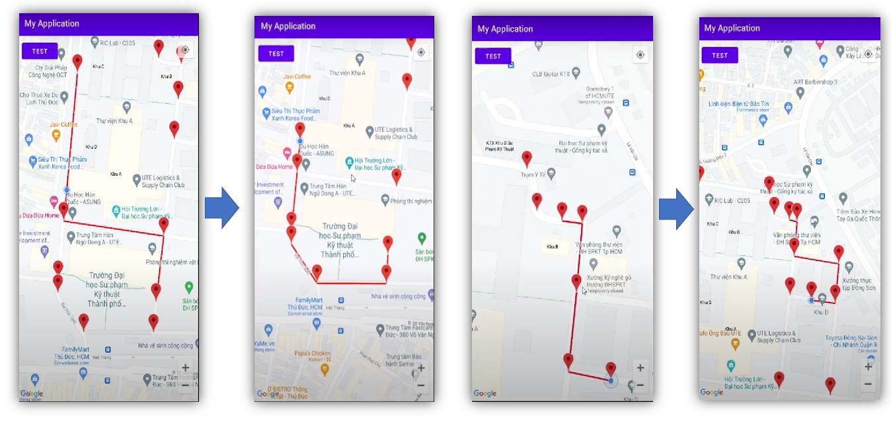

# Dijkstra_for_self_driving_car
## Introduces
This is the README file of the project [project name]. In this file you will find information about the project, installation instructions, directory structure, and instructions for use.
## Descriptions
- This application is used to provide route for self-driving car in a small area, here application is used in Ho Chi Minh University of Technical Education
- Provide turn or go straight signals when traveling on the road or when approaching intersections
- Use Dijkstra's algorithm to find the shortest path, and can find other backup paths when encountering obstacles while moving on a previously given route.
## Setting
To install the project, follow these steps:
1. Clone this repo to your computer with the command `git clone https://github.com/aTunass/Dijkstra_for_self_driving_car`.
2. Add dependencies in build gradles:
``dependencies {
    implementation 'com.google.firebase:firebase-database:20.1.0'
    implementation 'com.google.android.gms:play-services-maps:18.0.0'
    implementation 'com.google.android.gms:play-services-location:18.0.0'
    implementation 'org.jgrapht:jgrapht-core:1.5.1'
    testImplementation 'junit:junit:4.13.2'
    androidTestImplementation 'androidx.test.ext:junit:1.1.3'
    androidTestImplementation 'androidx.test.espresso:espresso-core:3.4.0'
    implementation 'com.karumi:dexter:6.2.2'
}``
3. Connect with your Realtime Database, get token of google map and add it to manifest file
4. Make other settings if available.
## Dijkstra
- Dijkstra's pathfinding algorithm uses a priority queue to traverse the vertices in the graph in order of path length from the starting vertex to that vertex. Initially, the path length from the starting vertex to itself is assigned zero, and the path length from the starting vertex to the remaining vertices is set to infinity.
- When traversing the vertex u, the algorithm updates the path length from the starting vertex to the vertices adjacent to u, if the new path length is shorter than the old path length, the path length is updated again. Then, vertex u is marked as considered and removed from the priority queue. This process is repeated until all vertices in the graph are considered.

## User manual
- There are three switch buttons, the green button is for debugging so don't use them.
- First select a point on the map, then press the light blue switch, once you have found the way, press the dark blue button
- When there is signal to change the line select yes, then continue to press the dark blue button again
- Hold down the debug button to reset
- [Demo video](https://www.youtube.com/watch?v=MvrC0cSQjAA)

